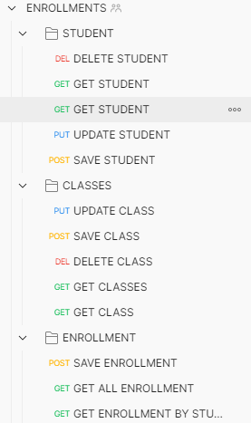

## Enrollment Manager

Este projeto contém uma aplicação que gerencia matrículas de Alunos á Classes Escolares.

1) Funcionalidades

   

2) [Collection postman](https://github.com/emanuelvictor/enrollment-management/blob/main/ENROLLMENTS.postman_collection.json)
3) Ficha técnica:
   1) Flyway para versionamento da base de dados;
   2) Controllers e Services construídas com Java Generics (Exemplo: public final Class<?>);
   3) TDD: Cobertura em 100% dos testes com JaCoCo;
   4) DDD: Arquitetura em Camadas utilizada.
4) Próximos passos:
   1) Construção de imagem docker;
   2) Publicação do container docker;
   3) Upload to heroku.

## Configuração de Ambiente 🚧
1) Tenha o postgresql 10+, MAVEN e JDK (Java Development Kit) instalados e configurados;
    - [Instalando o postgres no windows](https://www.devmedia.com.br/instalando-postgresql/23364);
    - [Instalando o postgres no linux](https://medium.com/@thiago.reis/instalando-e-configurando-postgresql-no-ubuntu-86716cda5894);
    - [Instalando e configurando o maven e a JDK](https://medium.com/beelabacademy/configurando-vari%C3%A1veis-de-ambiente-java-home-e-maven-home-no-windows-e-unix-d9461f783c26)
2) Crie um usuário e uma base de dados, ambos com o nome de "**enrollment**";
    - Se preferir, utilize outros nomes, mas altere os parâmetros em [application-dev.yml](https://github.com/emanuelvictor/enrollment-management/blob/main/src/main/resources/config/application-dev.yml).
3) Crie uma base de dados chamada "**enrollment_test**". Essa base será utilizada durante a execução dos testes automatizados;
    - Se preferir, utilize outros nomes, mas altere os parâmetros em [application-dev.yml](https://github.com/emanuelvictor/enrollment-management/blob/main/src/test/resources/config/application-dev.yml).
4) Depois da base configurada, rode o script sql [20220407142600__FIRST_DDL.sql](https://github.com/emanuelvictor/enrollment-management/tree/main/src/main/resources/db/migration/20220407142600__FIRST_DDL.sql).

## Execução e testes 🚀

1) Execute o comando ``mvn clean package && java -jar target/enrollments-0.1.jar`` na raíz do projeto.
2) A aplicação será iniciada na porta **8080**, o resultado dos testes estarão em *./target/site/jacoco/index.html*

<h4 align='end'> 
	Obrigado 😎
</h4>